Evolución Temperaturas Mundiales
========================================================
author: Alberto Tuero Abarrio
date: Junio 2015

Razón del estudio
========================================================

Como proyecto final del I Master en Data Science, nos planteamos la siguientes preguntas

- ¿Realmente estamos influenciados por un incremento incontrolado de temperatura mundial?
- ¿Las temperaturas están sujetas a un comportamiento periódico?
- ¿Actualmente estamos en un punto máximo de las mismas?
 

Origen de datos
========================================================

Para dar solución a las cuestiones anteriores se va a utilizar la información histórica de la NOAA 

 - Temperaturas Mundiales (ftp://ftp.ncdc.noaa.gov/pub/data/ghcn/daily/by_year/)
 - Información de los niveles de CO^2 (ftp://aftp.cmdl.noaa.gov/products/trends/co2/co2_weekly_mlo.txt)
 - Información de radiación solar (ftp://aftp.cmdl.noaa.gov/data/radiation/baseline/)

Análisis Puntos de observación (I)
========================================================

En la NOAA, hay disponible una base de datos pública de información meteorológica:

- Datos desde 1,763
- En 2016 se tiene un total de 100,300 puntos de observación distribuidos por todo el mundo
- Fuente de datos: ftp://ftp.ncdc.noaa.gov/pub/data/ghcn/daily/ghcnd-stations.txt 

Análisis Puntos de observación (II)
========================================================

En la base de puntos de observación, hay ciertos territorios con alta concentración de estaciones

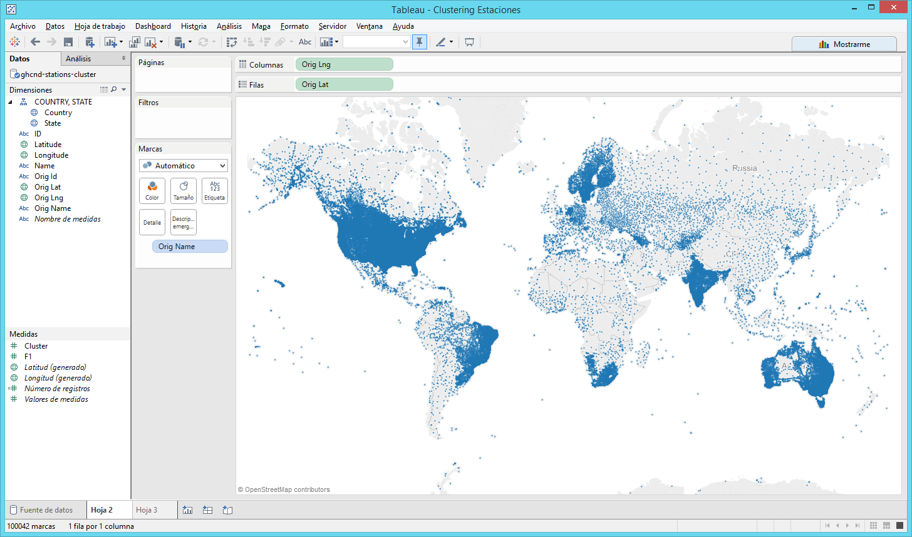

Análisis Puntos observación (III)
========================================================

Paises con alta concentración de estaciones:

- Australia: 17,088 Estaciones
- Brasil: 5,989 Estaciones
- Canada: 8,407 Estaciones
- Estados Unidos: 53,795 Estaciones
- India: 3,807 Estaciones
- Sudáfrica: 1,166 Estaciones
- Suecia: 1,712 Estaciones

Se calcula la media de Km^2 mundiales y se extrapola a estos paises para reducir el número de observaciones

Análisis Puntos observación (IV)
========================================================

Se aplica un algoritmo de clustering para agrupar estaciones en los paises con exceso de representación.  Finalmente se reduce la base de puntos de observación a 28,173 

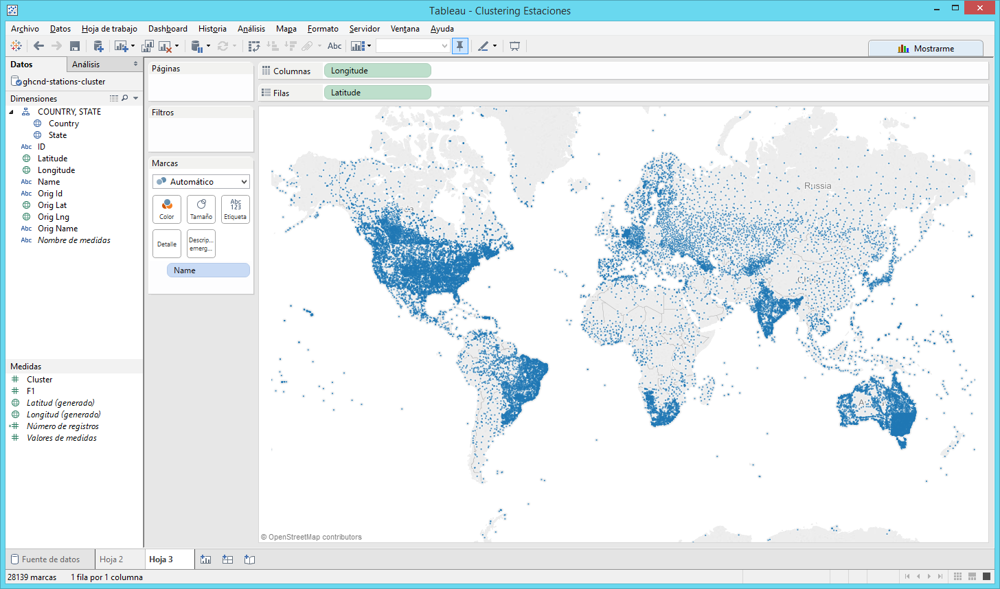

Análisis Temperaturas (I)
========================================================

Para explotar la información de las observaciones, se construye una base de datos en SQLite, tomando como base las 28,173 estaciones y las observaciones de cada cluster se calcula como la media de cada una de las observaciones de las estaciones en el día correspondiente.

Los datos se organizan en 8 tablas, una por continente

Una vez construida la base de datos unificada se analiza la información que contiene.  Se observa que de la gran cantidad información de indicadores, únicamente los relacionados con Temperatura máxima y mínima son los únicos que están suficientemente informados para realizar el estudio en el que estamos interesados

Análisis Temperaturas (II)
========================================================

Se observa que cada estación no presenta uniformidad en la información que presenta

No todas las estaciones tienen el mismo histórico de datos.  En la gráfica se presenta el número de observaciones de todas las estaciones en Europa

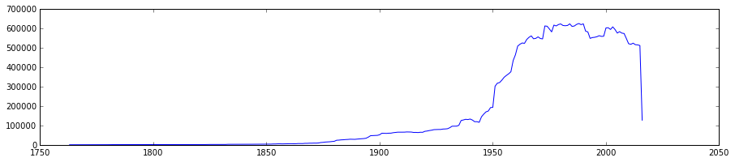

Análisis Temperaturas (III)
========================================================

En Europa, el número de observaciones crece a lo largo de la historia y en 1,950 hay un crecimiento exponencial.  Nuestro estudio debe limitar este efecto: debemos quedarnos con el mismo número de observaciones desde el primer año en el que estamos interesados hasta el final, para no tener efectos no deseados:

- Añadir una nueva estación en el sur incrementa la temperatura
- Añadir una nueva estación en el norte decrementa la temperatura

Ambos efectos deben ser aislados del estudio, ya que nos pueden conducir a resultados no válidos

Análisis Temperaturas (IV)
========================================================

Debemos tener un histórico mínimo, por tanto nos quedaremos con las estaciones existentes en Enero 1,900 y en Abril 2,016

Tras esta primera limitación, observamos que el número de observaciones sigue fluctuando

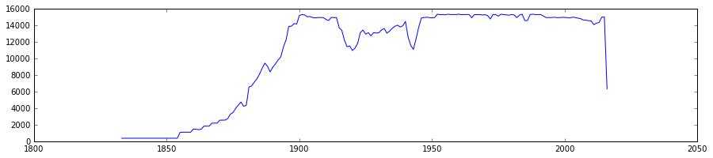

Análisis Temperaturas (V)
========================================================

El número de observaciones mostrado en la gráfica es relativamente estable, pero ¿Qué sucede en mitad de la gráfica que hace reducir significativamente el número de observaciones?

¿Qué sucedió entre 1,915 a 1,921 y entre 1,941 a 1,945 en Europa?

¡¡¡ LAS GUERRAS MUNDIALES !!!

Se debe eliminar también el efecto observado

Para ello se debe eliminar todas aquellas estaciones que entre el año inicial y el final de análisis presentan ausencia de información

Análisis Temperaturas (VI)
========================================================

La calidad del dato no es muy buena, ya que:

 - Estaciones sin datos en varios días al año, se eliminan aquellas a las que les falta al menos 5 días
 - Observaciones anómalas (ver gráfico), si la observación es mayor a 60ºC o inferior a -60ºC se elimina

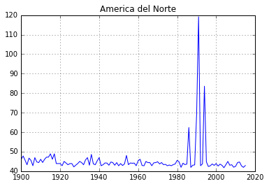
 

Análisis Temperaturas (VII)
========================================================

Una vez realizada la limpieza de datos, se lanza la ejecución para calcular la temperatura máxima y mínima media anual por continente de las observaciones desde 1900 a 2015, que nos devuelve lo siguiente:

 - En Europa únicamente hay 4 estaciones que cumplen todos los requisitos
 - En Norte América hay 210 estaciones que cumplen todos los requisitos
 - En Oceanía únicamente hay 4 estaciones que cumplen todos los requisitos
 
Para las estaciones del resto de continentes, los datos disponibles no tienen la suficiente calidad y son todas descartadas

Análisis Temperaturas (VIII)
========================================================

¿Qué sucede en el resto de continentes?

 1. De 1950 a 2015: Los Continentes Europa (40 estaciones), Norte América (906 estaciones) y Oceanía (18 estaciones) presentan mayor número de estaciones, pero no se añade ningún continente adicional

 2. De 1970 a 2015: Aparece una estación en América Central que cumple los requisitos

Debido a que el estudio a realizar necesita historia suficiente, no se sigue reduciendo el periodo, principalmente porque la calidad de las estaciones del resto de continentes no es suficientemente buena

Análisis Temperaturas - Europa
========================================================

Temperatura Máxima - Europa
========================================================

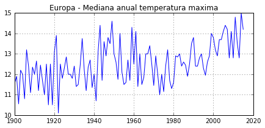
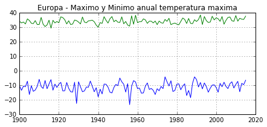

Este indicador presenta una cierta estacionalidad:

Entre 1940 y 1960, periodo de temperaturas elevadas, similar al periodo 2000 a 2015, aunque es cierto que 2014 fue excepcionalmente alto, aunque no se registraron temperaturas máximas más altas, sino que es debido a que más días del año hizo más calor

Temperatura Mínima - Europa
========================================================

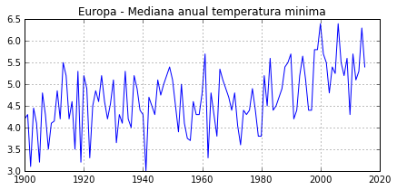
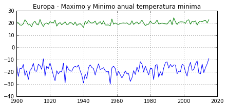

No parece presentar una estacionalidad muy clara

A partir de 1980 la mediana anual presenta un cambio importante y que queda confirmado a partir de 1998, en el que aparece un incremento aproximado a 1ºC frente a la serie histórica.  Las temperaturas mínimas anuales sufren un incremento continuado del indicador 

Análisis Temperaturas - Oceanía
========================================================

Temperatura Máxima - Oceanía
========================================================
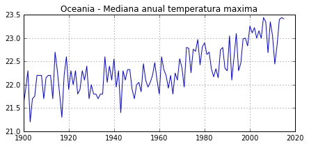
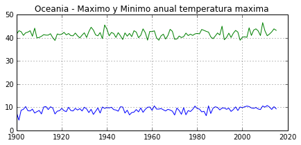
A partir de 1970 se una tasa continuada de incremento que en 2015 presenta un incremento total aproximado de 1ºC respecto al resto de la serie

Respecto a los máximos y mínimos anuales:
- Maximo anual ronda los 44ºC en 11 años, 4 en los últimos 16 
- Minimo anual ronda los 10ºC en 45 años, 12 en los últimos 16

Temperatura Mínima - Oceania
========================================================

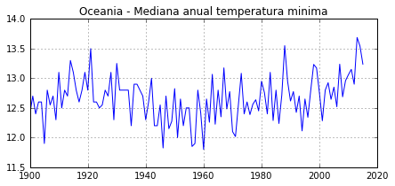
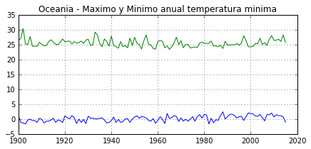

La mediana anual, presenta un valle en temperaturas desde 1940 a 2000, en 2014 se alcanza el máximo en la serie

El máximo anual, sigue el comportamiento de la mediana anual.  El mínimo anual, alcanza la tasa de 1ºC en 32 ocasiones, 11 en los últimos 16 años

Análisis Temperaturas - Norte América
========================================================

Temperatura Máxima - Norte América
========================================================

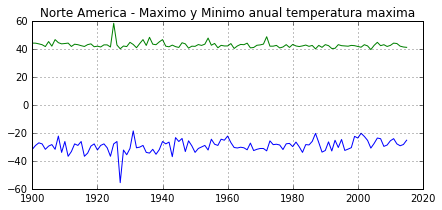

Entre 1930 y 1960, hubo un periodo de temperaturas altas, pero a partir de 1965 las temperaturas tienden a ser más bajas y no se recuperan hasta 2007, pero no alcanzan los niveles de la primera fase.  En 15 años se alcanzan los 19.5ºC 3 en los últimos 16 años

Máxima anual en la tasa más baja de la serie histórica, aunque parece que se incrementa levemente en los últimos 10 años

Temperatura Mínima - Norte América
========================================================

Presenta dos los periodos de temperaturas altas: de 1920 a 1950 y de 1998 a la actualidad.  La temperatura máxima se alcanzó en 2015, pero se superan los 5.7ºC en 16 años 5 veces en los últimos 15 años

El mínimo anual presenta un claro cambio en los últimos 16 años, ya que supera los -34.8ºC en 7 ocasiones, frente a las 6 veces en los 100 años anteriores

Resumen Resultados
========================================================

Según los datos observados, la temperatura experimenta ciclos y desde principios de siglo estamos en un ciclo de temperaturas máximas.  Cabe destacar que en los últimos 16 años, se observa cambio en

- Temperatura máxima en Oceanía, incremento de 1ºC
- Temperaturas mínimas no son tan extremas de forma global, por ejemplo en Europa la temperatura mínima se ha incrementado en aproximadamente en 1ºC

Globalmente no se experimentan temperaturas más altas, sino que los valores extremos mínimos no son tan bajos, por tanto parece que las temperaturas se están suavizando y ese es el cambio principal que se está experimentando

Análisis Otros indicadores
========================================================

Analicemos los datos disponibles en:

- Datos de C0^2 en el aire
- Datos de radiación solar

Nivel de C0^2
========================================================

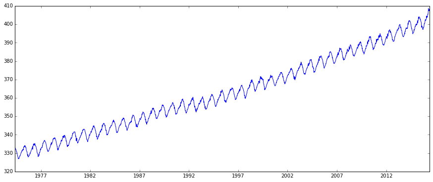

Tasa continua de crecimiento continuada que debería impactar en una tasa de crecimiento continua de temperaturas

Radiacion Solar (I)
========================================================

En la NOAA, hay disponible únicamente 9 puntos de observación, se seleccionan los 4 puntos con antigüedad previa a 1980

Es necesario saber que disponemos de observaciones:
- 1 por cada 3 minutos con anterioridad a 1998
- 1 por cada 1 minuto con posterioridad a 1998

Se consideran las medidas Directa, Difusa y Total entre las disponibles, se calcula la media de cada una de las medidas

Analizando las medidas de radiacion y temperaturas de las estaciones meterológicas, parece que no hay correlación entre unas y otras

Radiacion Solar (II)
========================================================

 

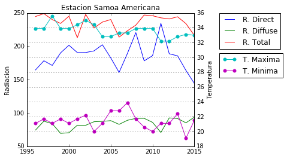 

Conclusiones
========================================================

Tras analizar los distintos indicadores y las temperaturas mundiales, la razón por la que la temperatura mínima se haya incrementado en los últimos años, no parece estar motivada por la radiación recibida del sol.

Los niveles de CO^2 en la atmósfera siguen una tasa de incremento continuada y ésta podría ser el motivo por el que las temperaturas mínimas se estén incrementando
